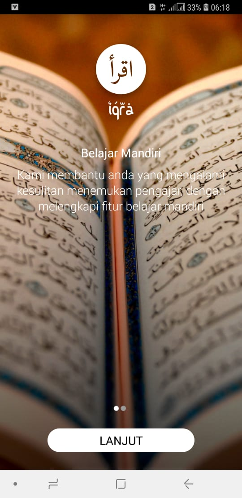
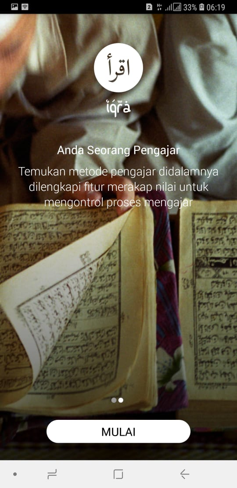
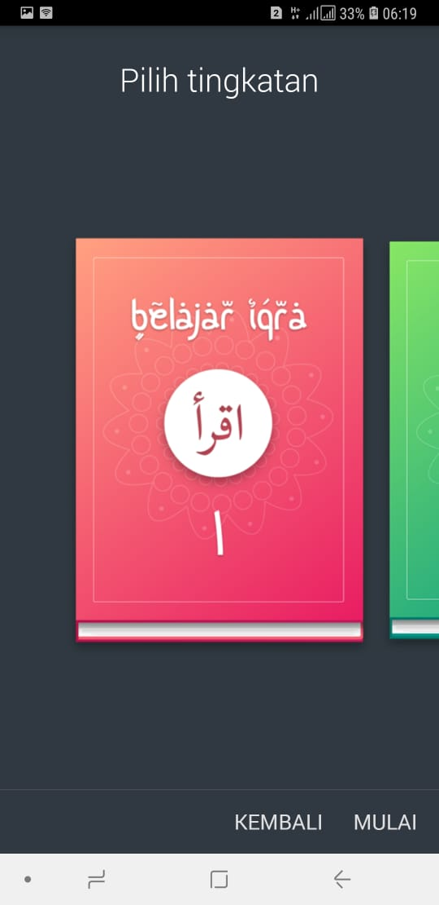
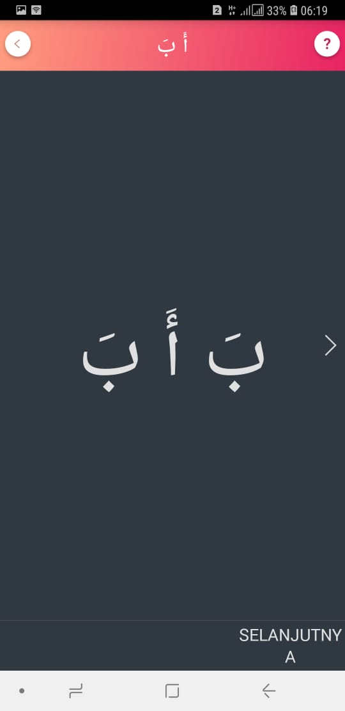
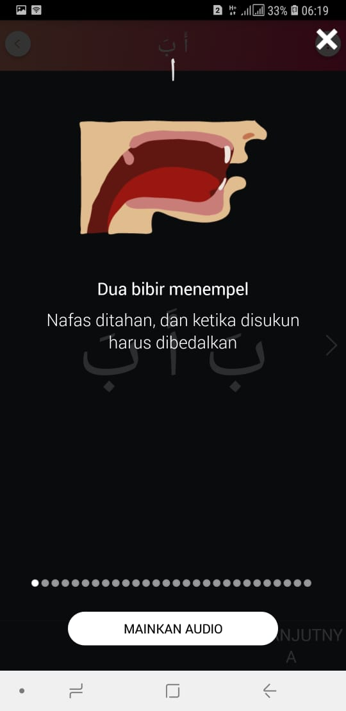
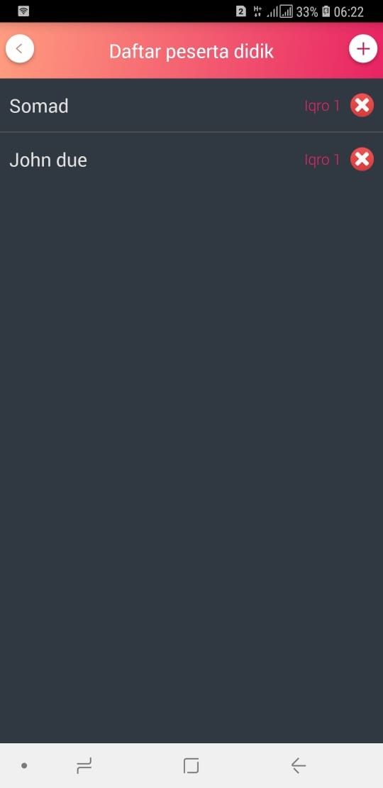
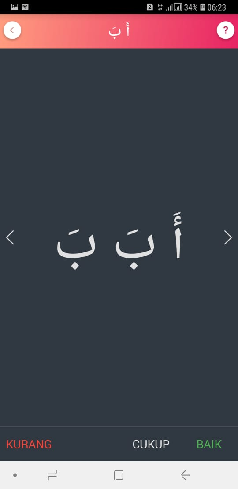
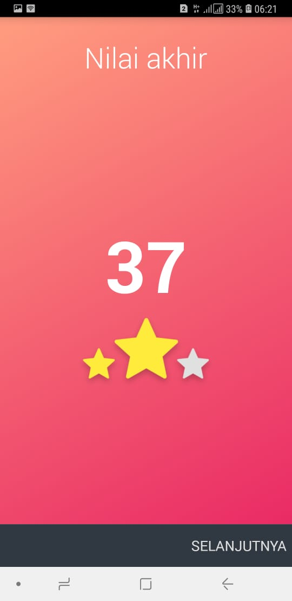
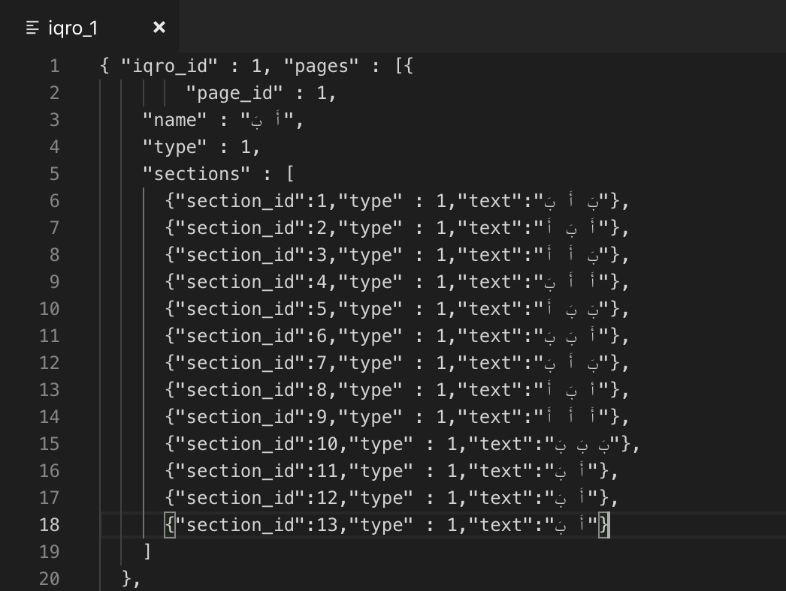

# Iqro Android
<b>Unfinished</b> iqro android project

Iqro merupakan metode belajar <b>Al-Qur'an</b> yang sangat populer di Indonesia, hampir seluruh anak di Indonesia belajar dengan metode iqro,
aplikasi dibuat bertujuan untuk membantu anak-anak lebih mudah belajar iqro dengan gadget mereka dan untuk orang tua / pengajar juga dapat menggunakan aplikasi ini dengan lebih interaktif.

</img>
</img>
</img>
</img>

#### Fitur
- Untuk Anak

anak-anak dapat mulai membaca sendiri, karena terdapat informasi makhroj huruf dan audio huruf tersebut.

</img>
</img>

- Untuk Orang tua / Pengajar

Orang tua atau Pengajar dapat mengunakan aplikasi iqro ini untuk mengajar dengan interaktif, diaplikasi ini terdapat fitur daftar anak yang belajar sehingga tersimpan status bacaan masing-masing anak saat ini sudah iqro brapa.
Dan juga terpadat fitur penilaian, jadi Orang tua atau Pengajar dapat menilai bacaan anak apakah kurang,cukup atau baik pada setiap sectionnya (1 halaman terdapat banyak section) kemudian diakhir section atau ketika ganti halaman akan ada total nilai dan juga terdapat bintang layaknya bermain game, ini dapat digunakan Orang tua / Pengajar sebagai pengambilan keputusan apakah  sang anak bisa lanjut kehalaman berikutnya atau tidak.

</img>
</img>
</img>
</img>

#### Note
aplikasi tidak kami lanjutkan karena kurangnya resource untuk membuat file `JSON` untuk konten iqro tersebut, diaplikasi ini baru dibuat untuk iqra 1 dan sebagian iqro 2 sedangkan yang dibutuhkan sampai iqro 6.

`app/src/main/assets/content/iqro_1`
</img>

#### Libs
* [NineOldAndroids](https://github.com/JakeWharton/NineOldAndroids)
